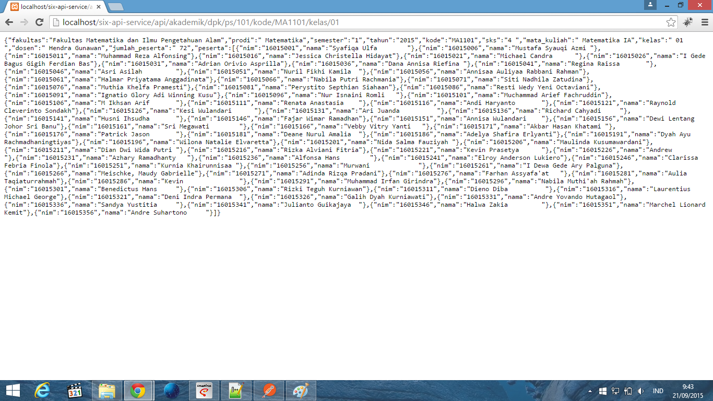
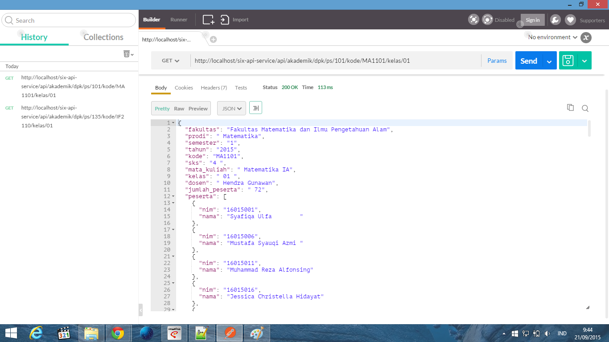

# README for Service Adapter Assignment on IF4050 2015

##Data:
 * NIM      = 13512081
 * Name     = Hendro Triokta Brianto
 * GithubID = ndro

##Requreiments:
 * Windows Operating System
 * Web server, ex: Apache XAMPP
 * CodeIgniter 3.0.1
 * Library CodeIgniter REST server : https://github.com/chriskacerguis/codeigniter-restserver

###How to Deploy:
 1. Download folder as Zip https://github.com/ndro/if4050-2015-ServiceAdapter/archive/master.zip atau clone repository ini https://github.com/ndro/if4050-2015-ServiceAdapter.git
 2. Simpan pada folder web server Anda
 3. Ubah nama folder sesuai yang diinginkan
 
###How to Run:
 1. Ketikkan pada web browser, ex: Chrome, http://localhost/six-api-service/api/akademik/dpk/ps/{kode jurusan}/kode/{kode Matkul}/kelas/{kelas}
	contoh : http://localhost/six-api-service/api/akademik/dpk/ps/101/kode/MA1101/kelas/01
 2. Ubah {kode jurusan}, {kode Matkul}, {kelas} sesuai yang diinginkan
 
###Screenshot

